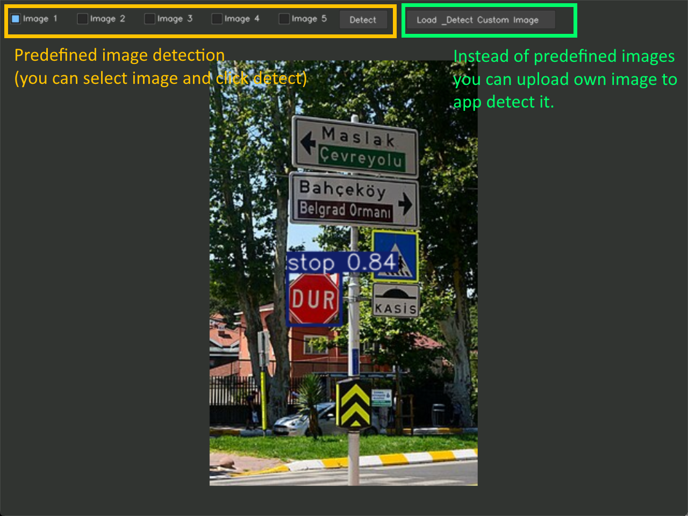

### **Stop Sign Detection with YOLO**

This application performs stop sign detection based on pretrained YOLO model and using these libraries; **OpenCV**, **cvui**, **ultralytics**, **tkinter**,and **NumPy**.

---

### **How to Install and Run**

You have two options options to get the app running:

1.  **Compile from source:** Install the necessary Python packages using `pip`:
    ```bash
    pip install opencv-python cvui numpy ultralytics
    ```
2.  **Windows executable:** Download the pre-compiled executable file from the [releases page](https://github.com/bedylmz/yoloTrafficSign/releases/tag/app).

---

### **Important Notes**

* **File Structure:** Do not change the names of the image files or the folder they are in. Altering the file structure may cause errors.

---

### **App Usage**



The app interface allows you to select a predefined images or you can upload custom image.

---

### **Model Training Results**


Trained with these data sets [Data Set 1](https://www.kaggle.com/datasets/adilahmedcs/stop-sign-dataset), [Data Set 2](https://www.kaggle.com/datasets/nhttinnguynbch/trafficsigns-detection-in-digital-racing)

---

### **Screenshots of Predefined Images' Detection**


.jpg)
.jpg)
.jpg)
.jpg)
